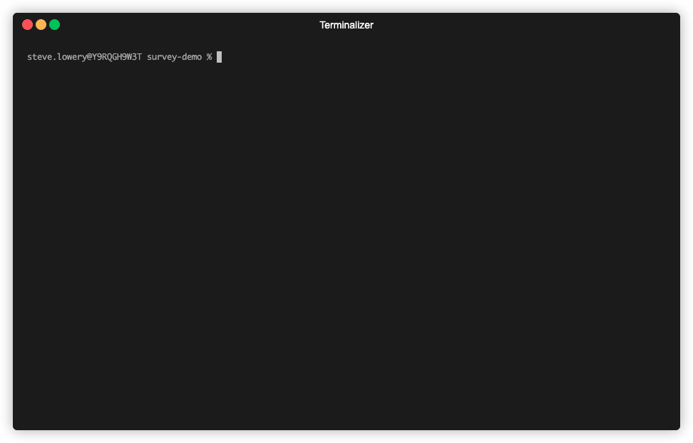

# survey-demo
This repo demonstrates the power of the survey cli library in golang.

## Usage
```sh
go run main.go
```

## Links
[AlecAivazis/survey](https://github.com/AlecAivazis/survey)

## Demonstrations

### Batch Mode


### Interactive Mode
